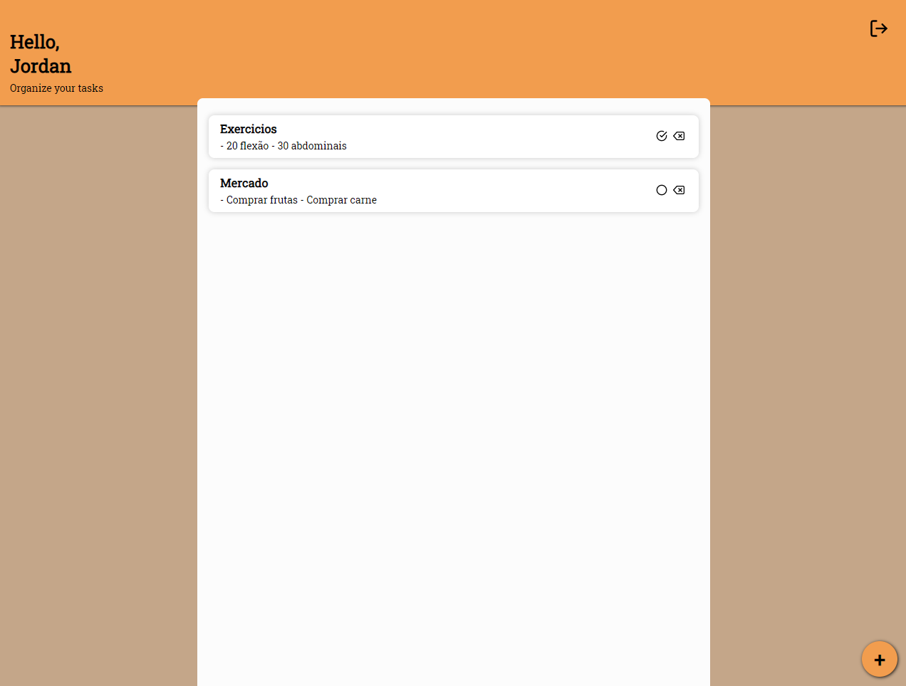

# ToDoApp

Project for study purposes. Implemented with ReactJS and backend with NodeJS.
The entire project is hosted on Firebase using Hosting for ReactJS and Function for the back end


<p align='center'>
  
  
</p>

# Installation

> git clone https://github.com/Trosdan/ToDoApp-Frontend.git

> yarn

Create `.env`

```
REACT_APP_API_KEY=
REACT_APP_AUTH_DOMAIN=
REACT_APP_DATABASE_URL=
REACT_APP_PROJECT_ID=
REACT_APP_STORAGEBUCKET=
REACT_APP_MESSAGING_SENDER_ID=
REACT_APP_APP_ID=

REACT_APP_BASE_URL=http://localhost:3333
```

> yarn start
